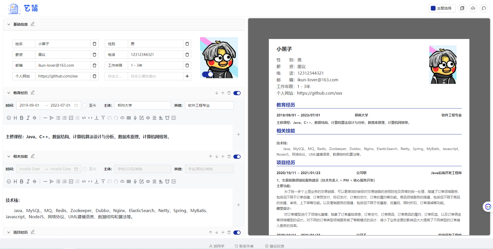
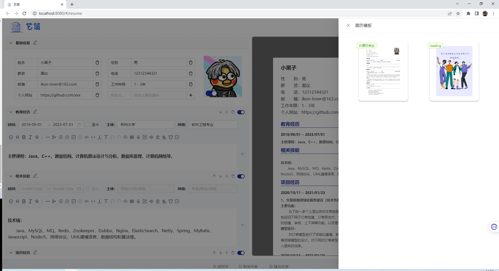

### 📑   Resume Online Generator
在线生成简历平台，无需额外操作，即可在线预览、编辑、生成PDF。

目前内置一套简洁模板，支持自定义主题颜色、Markdown语法支持、自定义模块标题，增加/隐藏模块以及子模块等.

### 如何使用（How to use）
在线Markdown编辑 -> 自定义模块 -> 自定义子模块 —> 一键生成简单雅致的PDF
### 页面预览
>主页预览
>


> 模板选择
> 


### 本地开发（Local Develop）

```shell
# yarn required, to see: https://www.yarnpkg.cn/
# Install dependencies
yarn install / yarn
# Then, startup project
yarn run serve
```
